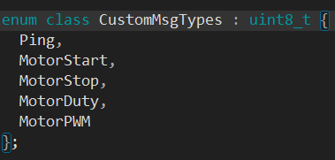
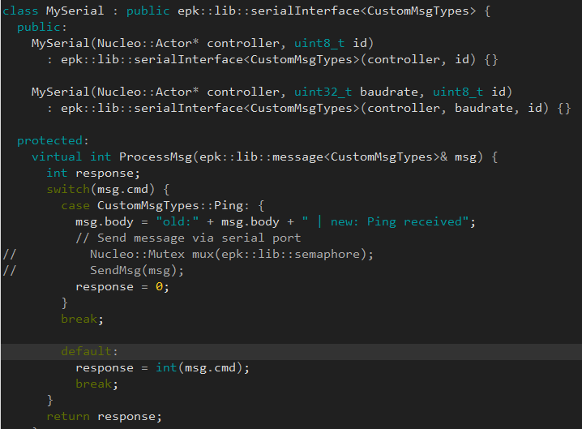
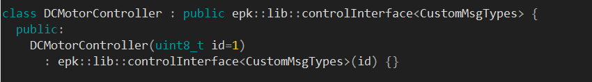
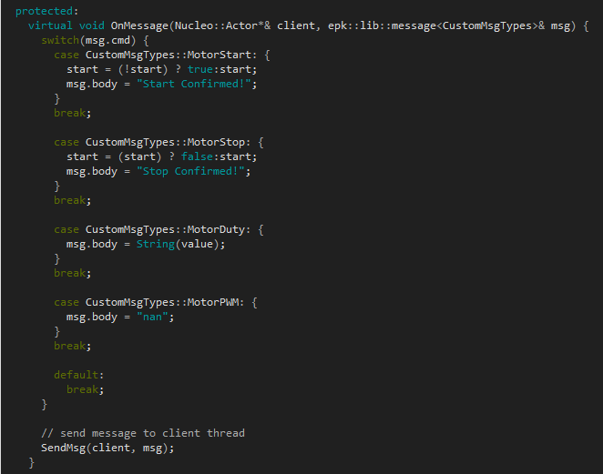
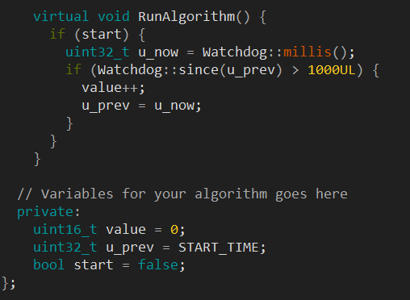

# Cosa-based Framework 

This is an Arduino library framework built on top of [Cosa](https://github.com/mikaelpatel/Cosa), an object-oriented platform for Arduino. The framework helps users create custom message types to be used via Serial as well as http and https protocols. It also has the fuctionality of running on Cosa Threads to give some level of concurrency on AVR, SAMD and ARM micro-controllers. In case there's a need to implement control for peripherals that exchange messages via serial especially DC Motor control, an implementation has been provided. The framework is still in the developmental stages so Issues and Pull requests are welcomed.

## Pre-requisite Installation

First of, the Arduino Software needs to be installed on your computer. Then the Cosa library has to be installed in the Arduino environment as well. Go to the [link](https://github.com/mikaelpatel/Cosa/blob/master/README.md) here and follow the instructions of its installation.

## Usage

- Include all the header files in this repository in your main.ino file. 
- Create your Custom Message Type using an **enum class** just as shown in the image below:
          .
- Create your custom classes inheriting form the various classes needed from the framework. 
  An example for the serial class is shown below:
          
   .
  
  As observed, the method *virtual int ProcessMessage(...)* needs to overrided by the user.
    
 Implementation of the controlInterface class is also shown below. 
 Again, this class has two protected classes that need to be overriden, *virtual void OnMessage(...)* and *virtual void RunAlgorithm()*.
 
   
   
   
    
## Contributing

Pull requests are welcome. For major changes, please open an issue first to discuss what you would like to change.

Please make sure to update tests as appropriate.

## License

No Licenses yet!
